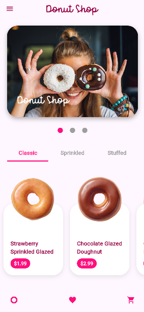
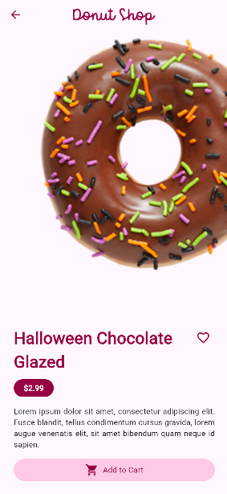
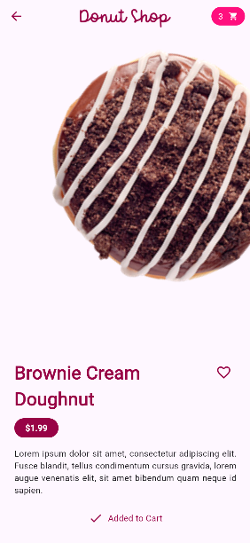
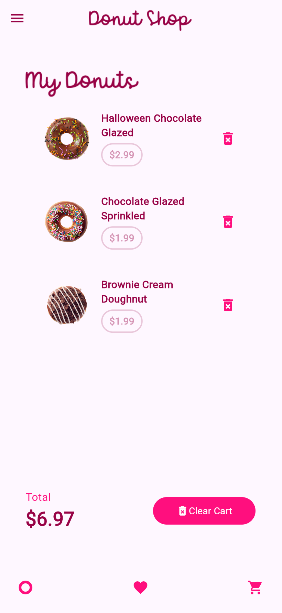
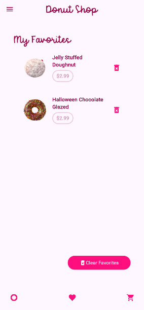

# Donut Shop UI

A Flutter practice project focused on UI layouts, state management with Provider, and basic animations. Built this to refresh my Flutter skills and experiment with some common patterns.

## What's Inside

This is a simple donut shop app with browsing, favorites, and a shopping cart. Nothing fancy, just solid fundamentals:

- **Provider for state management** - Managing cart items, favorites, and filter selections across the app
- **Custom layouts** - Stacks, positioned widgets, and responsive sizing
- **Hero animations** - Smooth transitions between list and detail views
- **Rotation animations** - Spinning donut on the details page using AnimationController
- **Bottom navigation** - Custom bottom bar with page switching

## Screenshots

### Home Page


Browse donuts by category with a filter bar and pager view at the top.

### Details Page


Donut spins continuously while you check out the details. Add to cart or mark as favorite.

### Add to Cart


Simple cart management - add items and see the badge update in real-time.

### Cart Page


Review your selections and see the total price calculated on the fly.

### Favorites


Keep track of your favorite donuts in a separate list.

## Key Concepts Practiced

- MultiProvider setup for managing multiple services
- ChangeNotifier pattern for reactive state updates
- Consumer and context.watch/read for accessing provider data
- SingleTickerProviderStateMixin for animation controllers
- Hero widgets for shared element transitions
- Custom widgets and component composition

## Running the Project

Standard Flutter setup:

```bash
flutter pub get
flutter run
```

That's it. Just a practice project to keep the Flutter muscles warm.
Credits - [@romanejaquez](https://github.com/romanejaquez)